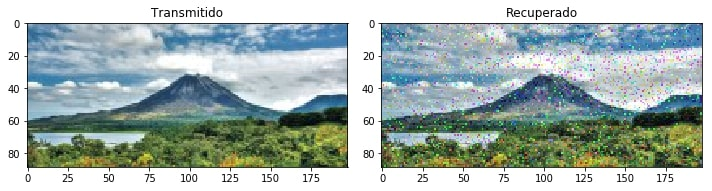
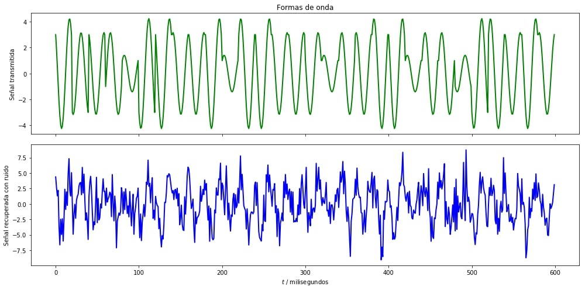
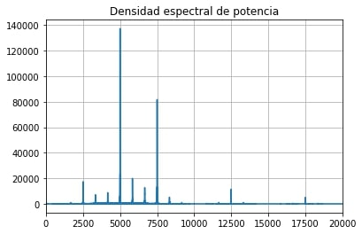

---
### Universidad de Costa Rica
#### IE0405 - Modelos Probabilísticos de Señales y Sistemas
---
* Estudiante: *Adrián Avilés Flores*
* Carné: *B80835*
* Grupo: *2*
---
# `P4` - *Modulación digital IQ*
---
## Modulación 16-QAM

### Imagen transmitida e imagen recuperada

### Onda transmitida y onda transmitida con ruido

#### En esta sección del proyecto se procedió a simular el procedimiento de transmisión de imágenes mediante la modulación 16-QAM, para ello fue necesario realizar una nueva función moduladora y demoduladora que trabajaran con 4 bits por símbolo. Para la prueba anteriormente realizada se utilizó una relación señal-a-ruido del canal (SNR) de -5 dB, por lo que la onda transmitida tuvo una afectación considerable y desembocó en una imagen recuperada con errores, pero se puede notar la gran similitud entre la imagen inicial y la final.
---

## Densidad espectral de potencia

### Densidad obtenida

